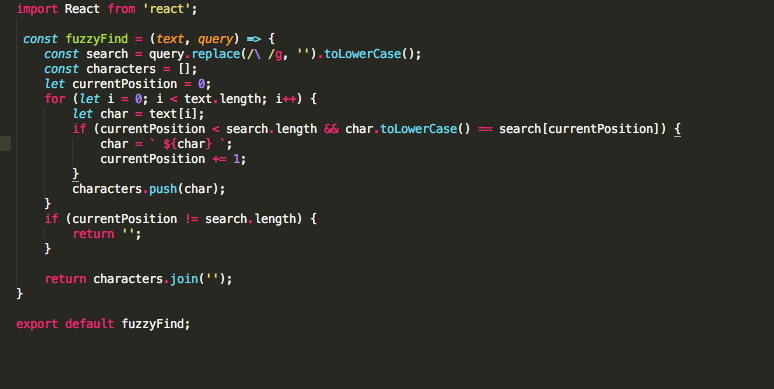
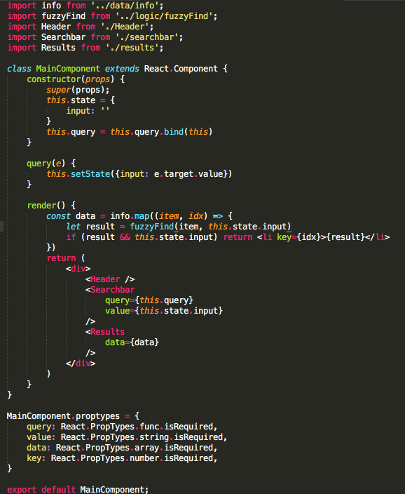
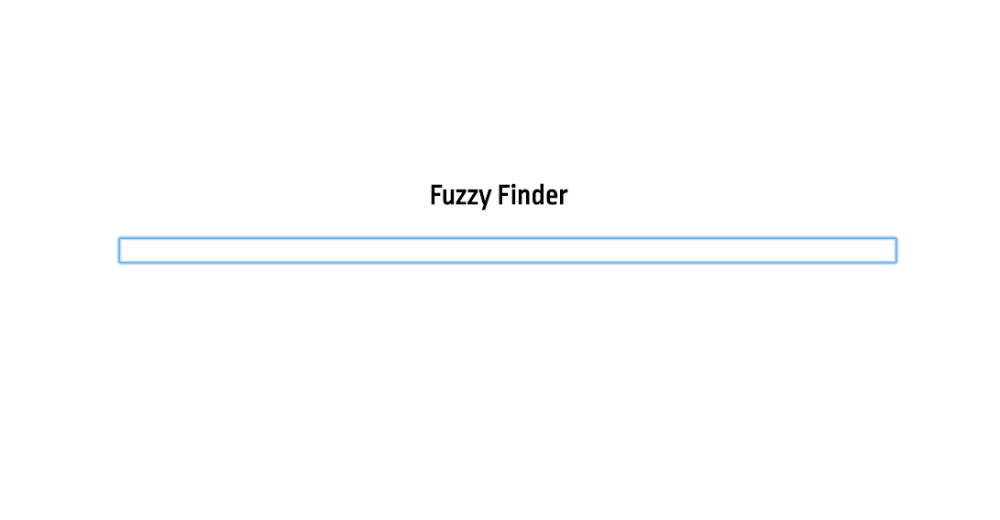
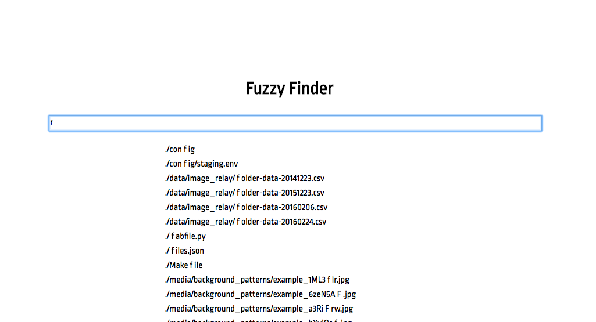

# fuzzyFinder

FuzzyFinder is a simple auto suggestion / fuzzy find app and an excellent view into the world of auto suggestion. 

In the journey to create a fuzzy finder I learned about auto suggestions using distance measurements. More can be found here.
https://en.wikipedia.org/wiki/Approximate_string_matching

I found this video on fuzzy find to be quite helpful and interesting as well 
https://www.youtube.com/watch?v=ahn-iyQPgpQ&t=969s

While many other companies use phonetics in combination with distance measurements to create a more powerful and useful solution I decided to create a more simple solution using character matching and character position filtering. I mostly chose to do this as I only had a few days to present an mvp and in most practical uses I would use a package for such a complex algorithm. 

## Fuzzy Finder Algorithm 

## Main Component 

## Screenshot 1

## Screenshot 2

To build: npm run build

To start the server: npm run start

To start in dev mode, with everything watched: npm run watch
